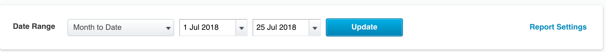
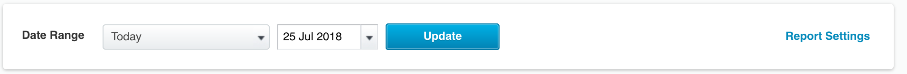
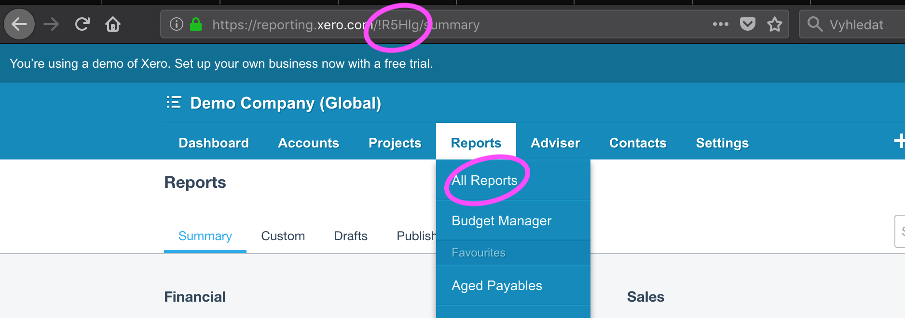

# configuration 

to list reports
```javascript
{

  "action": "list_reports",
  "username": "foo@bar.com",
  "account_id": "!abc12",
  "#password": "secret"
}
```

to download reports
```javascript
{

  "username": "foo@bar.com",
  "#password": "secret"
  "account_id" "!abc12",
  "action": "download_reports",
  "reports": [
    {
      "report_id": 12345,
      "filename":  "friendly_name_less_than_64_chars",
      "from_date": "last month",
      "to_date": "today"
    }
  ]
}
```

## Date ranges
Choose 
```
    "from_date": "timestamp",
    "to_date": "timestamp",
```

if the date range in the ui looks like this



or

```
    "to_date": "timestamp" 
```
if the date range in the ui looks like this



if you omit the date range, the default value (defined in the UI) will be used

The value can be either a human readable string or a string in format `23 Jun 2018`

## Account id
Get account_id by logging in to the UI, clicking reports and copying it from the url



Excels are converted to csv and uploaded to keboola with with [\u0001](https://www.fileformat.info/info/unicode/char/0001/index.htm) delimiter so that all columns are squashed into one called "data"

# License
This project is licensed under [GLWTPL](https://github.com/me-shaon/GLWTPL/blob/master/LICENSE) License
